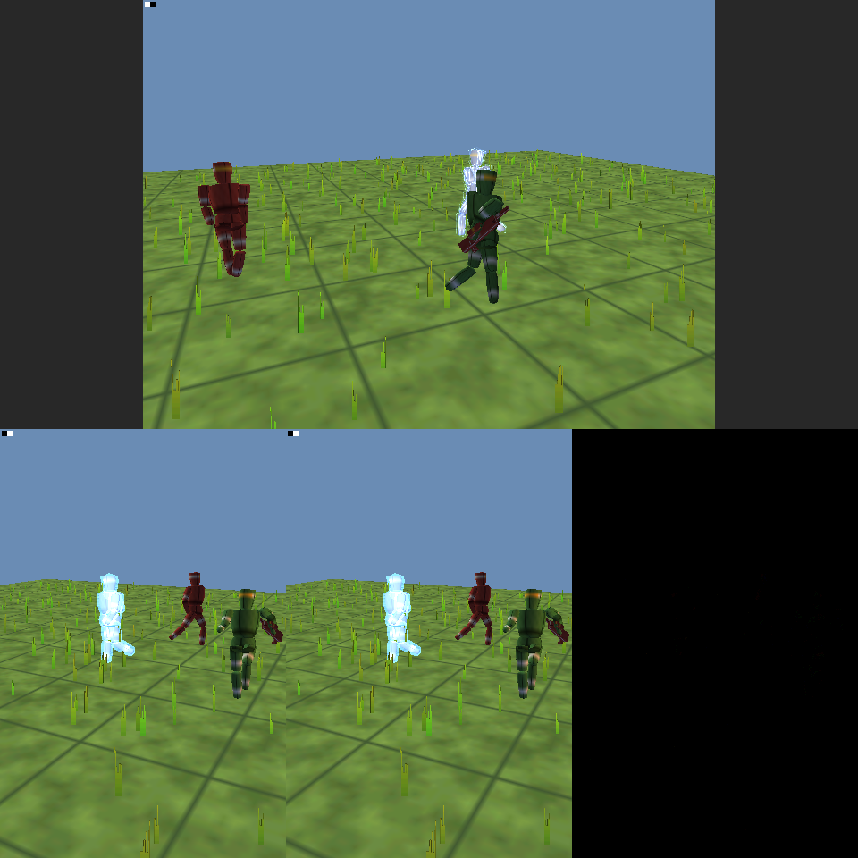

# Wii port (work in progress)

The plan, stage by stage, is in euryo's `docs/plans/2026-10-09-halo-on-the-wii.md`.
Everything here needs docker and the devkitPPC image (`docker pull devkitpro/devkitppc`).

## Build the .dol (stage 1)

From the repo root:

    ./port/wii/build.sh           # about a minute from clean on four cores
    ./port/wii/build.sh clean     # after a header change: units rebuild only when their .c is newer

The result is the Homebrew Channel folder, ready to copy to the root of an SD card:

    build/wii/sd/apps/halo/boot.dol
    build/wii/sd/apps/halo/meta.xml
    build/wii/sd/apps/halo/icon.png

`build/wii/halo-wii-sd.zip` is the same folder zipped: unzip it at the root of the card.

What it does today: it boots, keeps the game's fixed places out of the heap, mounts the
SD card, brings up a text console and runs the game's own `main`
(`source/shell/shell_xbox.c`). The game's log, `d:\debug.txt`, is the console, and the
console is copied to `sd:/halo/debug.txt`, so a run on a real Wii can be read afterwards
on a PC. With a `halo/maps` folder on the card (empty will do), the game's start-up shows:
the memory it places, its cache thread starting, its `z:\` cache files made on the card,
the GX device taking the screen (from then on the log is only on the card), and then a
halt in DirectSound (`channel->stream`, `sound_dsound_xbox.c`): audio is stage 6. Without
the folder it stops earlier, at `no valid map directory exists`. Each halt prints its
stack; resolve the addresses with
`powerpc-eabi-addr2line -f -e build/wii/halo.elf <address>...` in the devkitPPC image.

## What is in the link

| part | where |
| --- | --- |
| all 498 game units (`source/`, `port/linux/game/`) | as `port/linux/port.json` lists them |
| entry point, video and console | `src/wii_main.c` (libogc; the link wraps `main` and `exit`) |
| SD card, the console's copy on it, threads and waitable objects | `src/wii_os.c` (libogc), behind `src/wii_os.h` |
| C runtime names, printf with `%I64`, `fopen` by Xbox path | `src/wii_crt.c` |
| XAPI memory, time, errors, events, mutexes, threads, files, `ReadFileEx`/`WriteFileEx` | `src/wii_xbox.c` |
| pooled COMMON globals, wide-char runtime, null Bink, empty xbdm | from `port/linux/src/`, unchanged |
| the game's maths and zlib | `port/third_party/musl-math`, `port/third_party/zlib` |
| Direct3D, on GX (stage 4) | `src/d3d8_gx.c`, `src/d3d8_gx_resources.c`; `src/gx_backend.c` (libogc); `src/nv2a_vsh_run.c` |
| everything else (DirectSound, XInput, XNet, ...) | `build/wii/wii_stubs.c` |

`wii_stubs.c` is generated on each build by `gen_stubs.py` from what the first link
pass finds missing: each stub prints `wii: stub: <name>` the first time it runs and
returns 0. A stage replaces stubs by writing the real function in `src/`, and the
stub stops being generated.

The XDK's headers and libogc's cannot be read by one unit (`BOOL`, `u32` and others
clash), and the port's own `sys/stat.h` is MSVC's, so anything that needs libogc or
newlib's `stat` goes in `wii_os.c` and is called through `wii_os.h` in plain C types.

## The GX device (stage 4, first part)

`src/d3d8_gx.c` is the Xbox Direct3D device on the Wii's GPU, where the Linux port has
`d3d8_gl.c`. What it does, and what it does not do yet, is in its opening comment; in
short:

- **Vertex programs run on the CPU.** GX has no vertex programs, so each draw's vertices
  are read from the game's buffers by the shader's declaration and run through the
  game's own NV2A program by `src/nv2a_vsh_run.c`, with the semantics of the Linux port's
  GLSL translation, sixteen vertices at a time (below: "Vertex programs on the CPU").
- **GX's fixed transform does the projection.** The programs end in screen space; that
  is undone to a clip position, and a perspective matrix is fitted to each draw (Halo's
  depth is an affine function of w across a draw), so GX clips and interpolates
  perspective-correctly, as the NV2A did.
- **Textures:** the maps' bitmaps are in GX formats (the map converter's) and are sampled
  in place, by the Direct3D format `HALO_WII_D3DFMT_GX + GX_TF_*` (`halo_wii_map.h`).
  Textures the game makes as it runs, in Xbox formats, are converted to RGBA8 tiles.
- **Render state:** depth, blending, alpha test, culling, color writes, viewport and
  scissor, clears clipped to the viewport (split screen).
- **Pixel shaders:** the NV2A's register combiners become TEV stages (below).
- **Not yet:** render targets other than the back buffer (shadows, water, screen effects
  are skipped and counted), visibility tests (all visible), cube maps and 3D textures
  (sampled as their first face or slice), projected texture coordinates.

The game's vertical blank callback, which its frame throttle waits on, runs at every
blank from a thread above the game's (`gxb_set_vertical_blank_handler`).

`src/gx_backend.c` is the libogc half, behind `src/gx_backend.h` in plain C types, for
the same reason as `wii_os.h`.

### Checking it

    ./port/wii/tests/run.sh       # the vertex programs and the pixel shaders, on the host (below)

With no maps the game cannot reach its menu, so `build.sh` also makes
`build/wii/gxtest/sd/apps/halo-gxtest/boot.dol`, a scene (`gxtest/gxtest_scene.c`) that
drives the device as the game does, with pixel shaders of the game's kind: the game's
environment program (49) over a level of
compressed BSP vertices with GX-format textures, the widget program (56) for a menu with
Xbox-format textures made at run time, immediate mode, and checks for culling, the alpha
test and clears. In Dolphin:

    ~/euryo/scripts/dolphin/run.sh build/wii/gxtest/sd/apps/halo-gxtest/boot.dol 40 <outdir>

and the last of `<outdir>/Dump/Frames/framedump_*.png` is the held frame.

## Pixel shaders: the NV2A's combiners as TEV stages (stage 4, second part)

`src/nv2a_tev.c` translates each draw's combiner state (the `D3DRS_PS*` render states) to
up to 16 TEV stages, with the semantics of the Linux port's GLSL translation
(`port/linux/src/nv2a_psh.c`); its opening comment says how. The device keeps each
translation, keyed by the combiner state, the textures sampled, fog, and which constant
channels are 0 or 255 (those are folded in: the game picks channels with constants such
as `0x00ff0000`). The inputs are the two vertex colors, the four textures and the fog
factor, which reaches TEV as a fifth texture (a ramp looked up at the vertex's factor).

Of the game's 154 programs (`tests/psh_corpus.h`, transcribed from the rasterizer
sources), 135 fit, with their own constants and fog on. A program that does not fit is
not drawn, and the device logs it once: the environment's bump-mapped specular passes
(point and spot lights, the specular lightmap: 40 to 50 stages of reflection-vector
arithmetic), its dynamic diffuse light, the self-illuminated lightmap (33: its
texture-by-texture dot product and animated multiplexers all fall to the alpha pipe), and
a few screen effects, layered fog and the HUD's reverse-subtract screen geometry.

### Checking it

    ./port/wii/tests/run.sh

runs `tests/tev_test.c`: every corpus program and 3000 random ones through an NV2A
reference (floats) and a model of TEV's integer arithmetic as Dolphin computes it
(`tests/tev_models.h`), on random texels, colors, constants and fog. It fails when a
corpus program is off by more than 6/255 on more than 1% of inputs; random programs are
only reported (some flip a multiplexer at exactly 0.5, or pass TEV's ±4 range mid-sum).
`tev_test -v N` prints corpus program N's stages, `tev_test -s SEED` a random one's.

In Dolphin, `build.sh` makes `build/wii/tevtest/sd/apps/halo-tevtest/boot.dol`, the
shader sheet (`tevtest/`): each corpus program on a tile of its own, drawn by the GX
backend with known textures, colors and fog (magenta: not translated), its rgb for a
second and a half and then its alpha as gray. Check it pixel by pixel against the NV2A
reference:

    DOLPHIN_FRAME_DUMP_RAW=1 ~/euryo/scripts/dolphin/run.sh \
        build/wii/tevtest/sd/apps/halo-tevtest/boot.dol 15 <outdir>
    cc -std=c99 -O2 -Iport/wii/src -Iport/wii/tests -Iport/wii/tevtest -o tev_sheet_expect \
        port/wii/tevtest/tev_sheet_expect.c port/wii/src/nv2a_tev.c -lm
    ./tev_sheet_expect <folder> && python3 port/wii/tevtest/check.py <outdir>/Dump/Frames <folder> sheet.png

`check.py` prints each tile's worst and mean difference from the NV2A's and from the TEV
model's, and writes `sheet.png`: Dolphin's sheet, the reference, and their difference
eight times over.

## Vertex programs on the CPU: skinning and the effects (stage 4, third part)

GX has a fixed transform and no vertex programs, so all 67 of the game's NV2A programs run
on the Wii's CPU (`src/nv2a_vsh_run.c`): the skinned models (23 programs read their node
matrices at `c[-36]` through `a0`, from node index bytes that are node numbers times three,
with `c[-89].w` = 255.9375), and the effects that are made in the vertex program: the
plasma shell pushed out along the skinned normal, the detail objects' grass built as
sprites from packed bytes, glass, meters, fog and the rest.

- **Two executors, one meaning.** `nv2a_vsh_run` interprets a program for one vertex; it
  is the reference. `nv2a_vsh_run_batch` is what the device runs. A program is compiled
  once, when the game creates its shader (`nv2a_vsh_compile`), for the outputs the device
  reads: the components nothing reads afterwards are dropped, and the instructions left
  with none. The compiled program then runs each instruction over a batch of 16
  vertices, the registers laid out by component and then by vertex. The constant
  components it reads are spread across the batch first, so every operand is a row and
  every loop is branch-free. Runs of dot products that share their first operand (a
  matrix by a vector) go in one pass. Its results are the interpreter's, bit for bit.
- **The fetch** reads a batch at a time (`nv2a_vsh_fetch_lanes`), in the Wii's byte
  order: the map converter swaps the models' shorts and leaves their node index bytes.
- **Broadway has no square root instruction.** `rsq` is its reciprocal square root
  estimate made exact with three Newton steps, `floor` is inline, and the fetch multiplies
  where it divided (a division is 17 cycles).

### Checking it

    ./port/wii/tests/run.sh

runs `tests/vsh_gl_test.c` after the interpreter's own tests. The Linux port's translator
(`port/linux/src/nv2a_vsh.c`, built on the host through `tests/xgpu_host.h`) turns each of
the 67 programs into the GLSL the PC build draws with. Mesa's software GL runs that GLSL
headless (EGL's surfaceless platform; it needs only `libEGL.so.1`, and the test skips
itself without it), and transform feedback hands back every output of every vertex. The
same vertices, laid out by the program's own declaration, go through the Wii's fetch, the
interpreter and the clip recovery. Every output must agree with the GL reference: the clip
position, both colors and back colors, four texture coordinates and the fog. The batch
executor must agree with the interpreter to the bit, compiled for every output and then
for random subsets, with the device's batch fetch. A deliberate break in the fetch's
scale, the `arl` rounding or the liveness fails it.
`tests/vsh_dis.c` prints a program as it decodes; `tests/vsh_bench.c` times the two
executors on the host.

In Dolphin, `build.sh` makes `build/wii/skintest/sd/apps/halo-skintest/boot.dol`:

    mkdir -p <card>
    DOLPHIN_FRAME_DUMP_RAW=1 ~/euryo/scripts/dolphin/run.sh \
        build/wii/skintest/sd/apps/halo-skintest/boot.dol 80 <outdir> <card>
    python3 port/wii/skintest/check.py <outdir>/Dump/Frames sheet.png
    cat <card>/skintest.txt

`skintest/skintest_scene.c` draws three walking characters of eleven nodes, made of the
game's compressed model vertices, through the device. Each is drawn with one of the model
shader's skinned programs (10 point lights, 9 reflection, 17 planar fog), with the
game's camera, fog and lighting constants. There is also a rifle of one node in a hand
(27), a plasma shell with the game's constants and pixel shader (15), and grass (33). After
five seconds the screen splits. The left half is skinned by the programs; the right half
by the formula the game's own debug code uses (`rasterizer_debug_model_vertices`) on the
CPU, drawn with one identity node. Everything after the skinning is the same program on
both sides, so `check.py` requires the halves to agree. Over 90 frames: mean 0.002/255,
0.0003% of pixels off by more than 16/255 (the odd pixel on a triangle's edge). The log
(`sd:/skintest.txt`) has a self check: the batch executor against the interpreter, every
program, to the bit, on Broadway itself ("67 of 67"). It also has the timings.

### What it costs (Dolphin's emulated clock, not a Wii's)

| | the interpreter | the batch executor |
| --- | --- | --- |
| program 10 (skinned, two point lights; 66 instructions), running it | 22.6 µs a vertex | 4.3 µs |
| program 27 (one node; 24 instructions) | 8.6 µs | 1.3 µs |
| a skinned character's draw, all of it (fetch, program, clip, GX) | 24.7 µs a vertex | 5.1 µs |

GX submission and the projection fit are 2.6 ms of a frame of 9,632 vertices; the vertex
programs are the rest (36.7 ms). The arithmetic is now most of it, about eight
instructions per vertex per component. The next step is paired singles, which do two
vertices per instruction (plan stage 7, "Speed"), measured with the same log. The numbers
are Dolphin's: it counts instructions, not Broadway's latencies, so a real Wii will be
slower. That is for the test on a Wii.

## Files

The Xbox's drives are folders of `sd:/halo`: `d:\` is `sd:/halo` itself (the maps go in
`sd:/halo/maps`), and every other drive is `sd:/halo/<letter>`, made on first use.
FAT is case-insensitive as FATX is. `ReadFileEx` and `WriteFileEx` finish at once, and
their completion routine runs at the asking thread's next alertable wait, as on Win32.
The engine's threads run at main's priority (64). Directory listings (`FindFirstFile`),
file times, free space and save games (`XCreateSaveGame` and the rest, in the Xbox's
`UDATA\<id>\` layout, as the Linux port) work on the card.

**The card needs room.** On its first start the game makes six cache files in
`sd:/halo/z` and sizes them at once, as it did on the Xbox's hard disk: 770 MB, with
`savegame.bin` (6 MB) beside them. A full card is an error the game halts on
(`error_code==ERROR_SUCCESS` in `cache_files_windows.c`), not a quiet short file. With
the converted maps (about 1.8 GB), 4 GB is the smallest card that will do.

## Memory

`halo_wii_capacity.h` takes the place of `port/linux/include/halo_port_capacity.h`
(the Wii prefix includes it first). The Wii uses the Xbox's own pool sizes, not
the native builds' 128-player ones, and its own fixed places:

| what | where |
| --- | --- |
| game state, 6 MB | `0x81200000`, the top of MEM1 |
| tag cache, 22 MB | `0x90100000`, the foot of MEM2 |
| texture cache, 22 MB | `0x91700000` |
| sound cache, 4 MB | `0x92D00000` |

The heap is what is left: about 3.5 MB of MEM1 above the program (whose pooled
globals are 10 MB of it), then about 2.9 MB of MEM2 below IOS. libogc's `sbrk` moves
from MEM1 to MEM2 for good at the first request that does not fit, so nothing large
may come from `malloc`; the caches have places for that reason.

The Xbox's maps are linked to a tag cache at `0x803A6000`, where the Wii's code is,
so the map converter (stage 2) will have to rebase them to `0x90100000`
(`source/cache/physical_memory_map.c` takes the Wii's address under `GEKKO`).

## Boot it in Dolphin with no display

On the box, with euryo's runner (`docs/dolphin.md` there):

    mkdir -p <card> && cp -r build/wii/sd/apps <card>/
    ~/euryo/scripts/dolphin/run.sh <card>/apps/halo/boot.dol 25 <outdir> <card>

The frame is `<outdir>/Dump/Frames/framedump_1.png`. With the fourth argument, Dolphin's
SD card is made from `<card>` and written back to it when Dolphin stops, so the run's
`<card>/halo/debug.txt` is there to read.

## Syntax check

    ./port/wii/check.sh           # 498 OK, 0 FAIL

It writes the inputs under `build/ppc/` (git-ignored) and runs `ppc-syntax-check.sh`
in the devkitPPC image; failures, with their first errors, are in `build/ppc/result.txt`.
